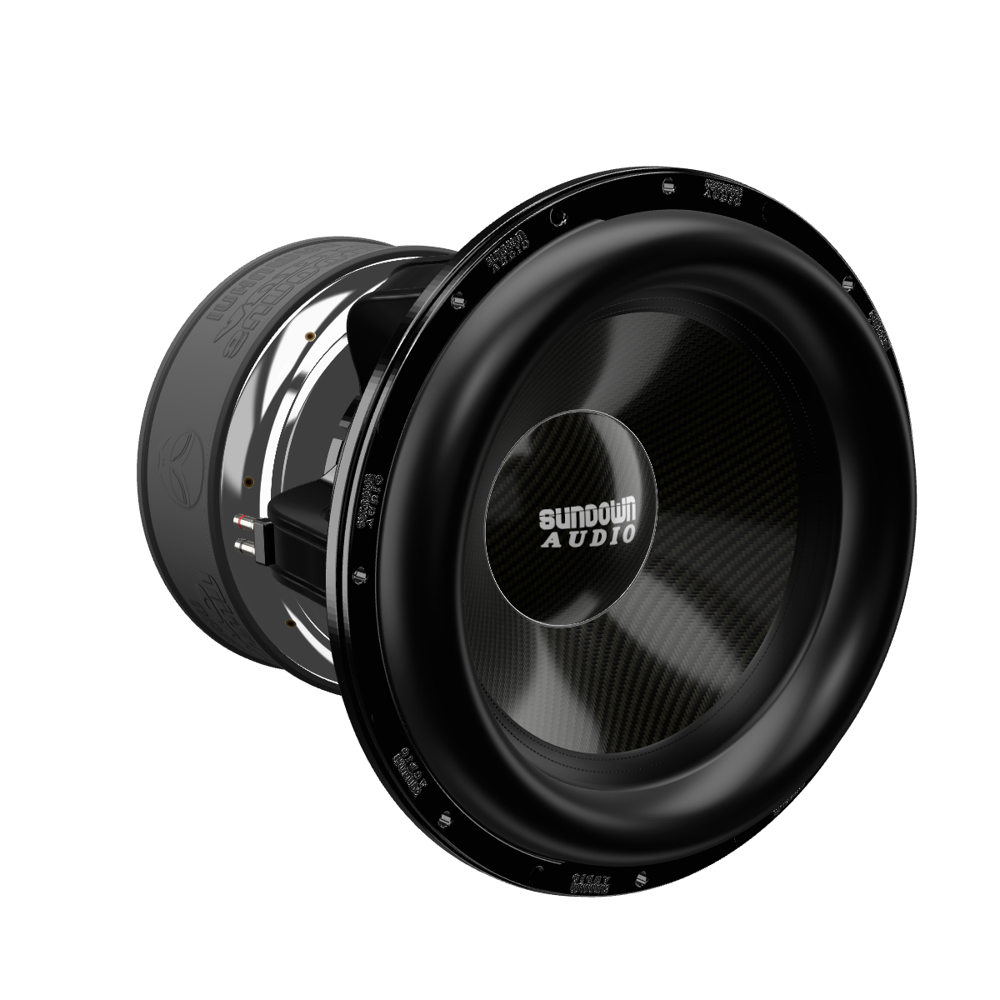

# Sundown Audio InHuman 18″ — procedural 3D model

An unofficial, fully procedural Three.js recreation of the **Sundown Audio InHuman 18″** subwoofer,
built from the five reference photos it was requested from and checked against them view by view.
No meshes were downloaded or traced: every part is generated in code (`src/model/`), and the
textures (carbon twill, moulded boot lettering, flange badges, printed dust-cap logo) are drawn
procedurally at load time.



## View it

The viewer is a static page that loads three.js from jsDelivr:

```bash
cd inhuman-subwoofer
npm run serve          # or: npx serve .  /  python3 -m http.server
# open http://localhost:8080
```

Drag to orbit, scroll to zoom. Buttons switch between preset views, toggle auto-rotate, and
download the model as GLB.

A ready-made export lives at [`models/sundown-inhuman-18.glb`](models/sundown-inhuman-18.glb)
(metres, Y-up, cone facing +Z; PBR materials with clear-coat, sheen and anisotropy extensions).

## What is modelled

| Part | Notes |
| --- | --- |
| Flange + gasket ring | 480 mm OD, 16 holes on a 457 mm circle: 8 countersunk through-holes alternating with 8 black socket-head screws in counterbores; 8 raised SUNDOWN AUDIO badges in every other gap |
| Surround | Tall "Mega-Roll" (≈40 mm above the flange) with a glossy glue lip and two rows of stitching on the cone |
| Cone + dust cap | Clear-coated 2×2 twill carbon (planar-mapped like the real layup), 147 mm domed cap with the printed perspective SUNDOWN AUDIO mark and a bright rolled rim |
| Basket | Six swept spokes with raised rails, upper ring, five-terrace spider landing, faceted lower cup, slotted mount ring, chrome cup screws |
| Internals visible through the windows | Corrugated spider, voice-coil former, cone back |
| Motor | Mirror-chrome top plate with 8 threaded holes, moulded rubber boot (SUNDOWN / AUDIO / INHUMAN ×3 and the alien head ×3, alternating every 60°), spun-chrome back cone, satin centre plate with 16 + 8 holes, pole vent with the bullet tip of the pole piece |
| Terminals | Two blocks 180° apart on the spokes, nickel posts with red/black polarity bands and set screws |

Dimensions (mm) are measured from the photos scaled to the 480 mm flange and live in
`DIMS` at the top of [`src/model/subwoofer.js`](src/model/subwoofer.js).

## How it was matched to the photos

1. **Measurements.** A polar unwrap of the straight-on front photo gives the radii of every ring
   (flange, bolt circle, gasket edge, roll, stitching, dust cap) and the angular layout of holes,
   screws and badges. Depths come from the manufacturer's side-profile shots.
2. **Camera fitting** (`tools/fit-cameras.mjs`). For each photo a perspective camera is solved by
   maximising the overlap (IoU) between the photo's alpha mask and a rendered silhouette, with
   Nelder–Mead started from several lens lengths, plus landmark constraints (back-disc centre,
   dust-cap apex, bolt circle, stitch line) where the silhouette alone is ambiguous. The photos
   turned out to be shot close-up with a fairly wide lens (≈30–44° vertical FOV).
3. **Feature alignment** (`tools/overlay.mjs`). Projecting landmarks into the photos fixes the
   angular positions of the spokes, terminals and boot markings relative to the flange badges.
4. **Look development** (`tools/compare.mjs`). Side-by-side renders against each photo drove the
   materials and the camera-locked studio lighting (`src/studio.js`).

Silhouette overlap with the five reference photos from the fitted cameras:

| Photo | View | Fitted lens (vertical FOV) | Silhouette IoU |
| --- | --- | --- | --- |
| 1 | rear ¾ from the right | 45° | 0.978 |
| 2 | rear ¾ from the left | 44° | 0.977 |
| 3 | straight-on front | 32° | 0.995 |
| 4 | front ¾ | 28° | 0.972 |
| 5 | close-up of the cone (mostly cropped; fitted mainly on landmarks) | 26° | 0.975 |

Renders from those cameras are in [`renders/`](renders/) (`photo1.png` … `photo5.png`).

## Tooling

```bash
npm install                                   # three + playwright (uses the system Chromium)
node tools/render.mjs [outDir] [size] [views] # render presets (src/views.js) to PNG
node tools/export-glb.mjs [file.glb]          # export the model
node tools/fit-cameras.mjs <photoDir> [outDir] [ids]   # refit cameras to 1.webp … 5.webp
node tools/compare.mjs <photoDir> [outDir] [height]    # photo | render | silhouette overlap
node tools/overlay.mjs <photoDir> <id> [out.png]       # landmark projection check
```

The reference photos are not included in the repository; point the tools at a folder holding
them as `1.webp` … `5.webp`.

## Known approximations

- The AUDIO lettering uses the system's bold-italic serif font (Georgia on most desktops,
  Liberation/DejaVu Serif on Linux), so its exact letterforms vary slightly by platform.
  SUNDOWN, INHUMAN and the alien head are custom vector drawings.
- Only what is visible is modelled; the magnet stack, voice coil and tinsel leads inside the
  motor are not.
- Embossed lettering and badges are normal-mapped rather than real geometry.
- Lighting is a studio approximation; real-photo reflections of the object on itself (spokes in
  the chrome) need a path tracer and are not reproduced.

*Unofficial fan-made replica. Sundown Audio and InHuman are trademarks of their owner.*
